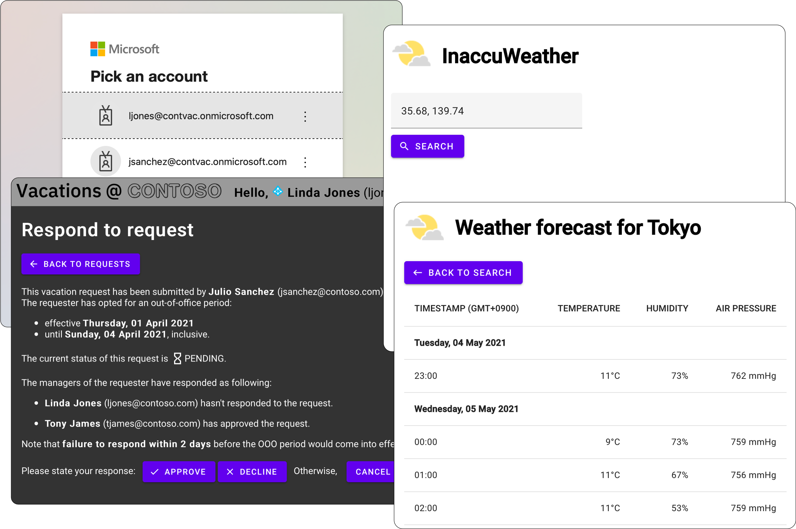

# Java EE web apps

Various proof-of-concept _Java EE 8 web apps_ that I developed during the Web Technologies course of UniTBv. This repository includes:

- [_JForums_](./JForums/), a topic-driven CLI discussion platform that relies on web sockets for establishing efficient client-server communications;
- [_InaccuWeather_](./InaccuWeather/), an asynchronous weather forecast generator based on servlets;
- [_Vacations@Contoso_](./Vacations@Contoso/), a time-off manager powered by PostgreSQL, Azure AD and OAuth 2.0. Check out the relevant case study [here](https://youtu.be/MfNQ-L19mjo).